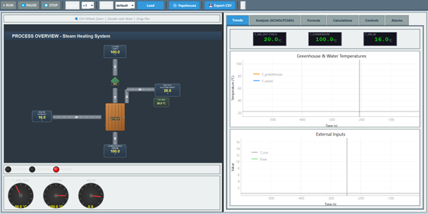

# Greenhouse Air Heating System - SCADA Emulator

A professional **PyQt6-based SCADA application** simulating a greenhouse air heating system using secondary steam in a shell-and-tube heat exchanger. Features P/PI/PID control, real-time visualization, alarm management, and industrial-quality HMI.

[](https://www.python.org/downloads/)
[](https://www.riverbankcomputing.com/software/pyqt/)
[](LICENSE)



---

## 🌟 Key Features

### Process Simulation
- **Physical Model**: Air heating via steam condensation in shell-and-tube heat exchanger
- **Second-Order Dynamics**: Aperiodic system with transport delay
- **Accurate Thermodynamics**: Euler integration with configurable time step
- **Real-Time Execution**: Runs at 1×, 5×, or 10× real-time speed

### Control System
- **Universal Controller**: Selectable P, PI, or PID control
- **Anti-Windup**: CLAMPING or BACK_CALCULATION modes
- **Bumpless Transfer**: Smooth MANUAL→AUTO switching
- **Transparent Operation**: Individual P, I, D term display

### Professional HMI
- **SCADA Graphics**: QGraphicsScene-based scalable process visualization
- **Real-Time Plots**: T_air_in and T_air_out trending (pyqtgraph)
- **Alarm Management**: Configurable thresholds with hysteresis
- **DPI Scaling**: Works correctly at 100%/125%/150%/200%
- **Fullscreen Support**: No compression, optimized layouts

### Engineering Tools
- **Parameter Presets**: 5 built-in configurations (default, winter, summer, fast, slow)
- **Disturbance Scenarios**: Step, ramp, pulse, sinusoidal patterns
- **Data Logging**: CSV export for analysis
- **Formula Documentation**: Embedded equation reference

---

## 📋 Table of Contents

- [Installation](#installation)
- [Quick Start](#quick-start)
- [Physical Process](#physical-process)
- [Controller Implementation](#controller-implementation)
- [GUI Interfaces](#gui-interfaces)
- [Command Line Usage](#command-line-usage)
- [API Reference](#api-reference)
- [Configuration](#configuration)
- [Testing](#testing)
- [Documentation](#documentation)
- [Troubleshooting](#troubleshooting)
- [Contributing](#contributing)
- [License](#license)

---

## 🚀 Installation

### Prerequisites

- **Python 3.8 or higher**
- **pip** package manager
- **Operating System**: Windows, Linux, or macOS

### Install Dependencies

Clone the repository and install requirements:

```bash
git clone https://github.com/yourusername/greenhouse-heating-scada.git
cd greenhouse-heating-scada
pip install -r requirements.txt
```

### Verify Installation

Run the test suite:

```bash
pytest tests/ -v
```

All tests should pass ✅

---

## 🎯 Quick Start

### 1. Launch SCADA Interface (Recommended)

```bash
python app.py --scada
```

**Features:**
- Professional SCADA HMI with TRACE MODE styling
- Process graphics with flow animation
- P/PI/PID controller selection
- Real-time trending
- Alarm monitoring

**Keyboard Shortcuts:**
- **Space**: Run/Pause simulation
- **R**: Reset to initial state
- **S**: Single step
- **1/5/0**: Speed ×1/×5/×10
- **F11**: Toggle fullscreen

### 2. Material Design Interface

```bash
python app.py --modern
```

Modern flat UI with Material Design principles.

### 3. Simple Interface

```bash
python app.py
```

Basic interface for testing.

### 4. Headless Batch Simulation

```bash
python app.py --headless --minutes 60 --csv output.csv --preset winter
```

Run a 60-minute simulation in batch mode and export to CSV.

---

## 🏭 Physical Process

### System Description

The simulator models a **greenhouse air heating system** using secondary steam:

```
Secondary Steam (100°C) ──→ Shell-and-Tube HEX ──→ Air Out (THK-0083) ──→ Greenhouse
                                    ↑
                                Air In (16-22°C)
                                    ↓
                           Steam Condensate Drain
```

**Physical Process:**
1. **Secondary steam** (~100°C) enters tube side of heat exchanger
2. **Ambient air** (16-22°C) enters shell side from **BOTTOM**
3. **Heat transfer** occurs from steam to air
4. **Heated air** exits from **TOP** to greenhouse
5. **Steam condenses** and drains from bottom
6. **THK-0083 sensor** measures outlet air temperature

### Control Loop

- **PV (Process Variable)**: T_air_out from THK-0083 sensor
- **SP (Setpoint)**: Target outlet air temperature (default 22°C)
- **MV (Manipulated Variable)**: Steam valve opening (0.0-1.0)
- **Controller**: P, PI, or PID with anti-windup

### Model Equations

#### 1. Transport Delay (L seconds)

```
u_dead = Delay(Flow, L)
```

Implemented via ring buffer with N = round(L / dt_sec) samples.

#### 2. Second-Order Aperiodic Dynamics (Air Temperature)

```
T1·T2·ÿ + (T1+T2)·ẏ + y = K·u_dead + Kz·(T_air_in - TambRef)
```

Where:
- **T1, T2**: Time constants (thermal mass and heat transfer)
- **K**: Heating gain coefficient
- **Kz**: Ambient temperature coupling
- **y**: Outlet air temperature (T_air_out)

Integrated using **Euler method**:

```python
sumInvT = (1/T1) + (1/T2)
invT1T2 = 1/(T1*T2)
ydd = -sumInvT * yd - invT1T2 * y + K * u_dead + Kz * (T_air_in - TambRef)

x2_new = x2 + dt_sec * ydd
x1_new = x1 + dt_sec * x2
T_air_out = x1_new
```

#### 3. Condensate Temperature (First-Order Lag)

```
dT_condensate/dt = (KUW·T_air_out - T_condensate) / TW
```

Where:
- **T_condensate**: Steam condensate/metal equivalent temperature
- **KUW**: Air-to-condensate coupling coefficient
- **TW**: Condensate thermal time constant

### Default Parameters

| Parameter | Default | Unit | Physical Meaning |
|-----------|---------|------|------------------|
| K | 0.8 | - | Heating gain coefficient |
| T1 | 120.0 | s | First time constant (thermal mass) |
| T2 | 60.0 | s | Second time constant (heat transfer) |
| L | 10.0 | s | Transport delay (pipe/duct length) |
| Kz | 0.02 | - | Ambient coupling coefficient |
| TambRef | 0.0 | °C | Reference ambient temperature |
| KUW | 0.5 | - | Air-to-condensate coupling |
| TW | 90.0 | s | Condensate thermal time constant |
| Kp | 0.05 | - | Proportional gain |
| Ki | 0.005 | 1/s | Integral gain |
| Kd | 0.0 | s | Derivative gain (PID mode only) |

---

## 🎛️ Controller Implementation

### P Control (Proportional Only)

```
Output = Kp × error
```

**Advantages:**
- Simple, fast response
- No overshoot issues

**Disadvantages:**
- Steady-state error

**Use Case:** Fast processes where small offset is acceptable

### PI Control (Proportional + Integral)

```
Output = Kp × error + Ki × ∫error dt
```

**Advantages:**
- Eliminates steady-state error
- Good disturbance rejection

**Disadvantages:**
- Can overshoot
- Integral windup if not handled

**Use Case:** Most common, default for temperature control

### PID Control (Proportional + Integral + Derivative)

```
Output = Kp × error + Ki × ∫error dt + Kd × d(PV)/dt
```

**Advantages:**
- Fast response
- Reduced overshoot
- Excellent setpoint tracking

**Disadvantages:**
- Sensitive to measurement noise
- Requires careful tuning

**Use Case:** Fast processes requiring minimal overshoot

### Anti-Windup Mechanisms

**Problem:** When output saturates (0% or 100%), integral keeps accumulating, causing overshoot when unsaturating.

**Solution 1: CLAMPING**
```python
if output_saturated and (integral would increase saturation):
    don't integrate
else:
    integrate normally
```

**Solution 2: BACK_CALCULATION**
```python
saturation_error = output_actual - output_unclamped
integral += error * dt + tracking_gain * saturation_error * dt
```

### Bumpless Transfer

**Problem:** Switching from MANUAL to AUTO causes output jump.

**Solution:** Initialize integral term so output matches manual value:

```python
# When switching from MANUAL to AUTO
integral = (manual_output - Kp * error) / Ki
```

This ensures smooth transition without process disturbance.

### Derivative Filtering

**Problem:** Derivative of noisy signal is very noisy.

**Solution:** First-order filter on derivative term:

```python
alpha = dt / (tau + dt)
filtered_derivative = (1 - alpha) * filtered_derivative + alpha * raw_derivative
D_term = Kd * filtered_derivative
```

Default filter time constant: τ = 0.1s

---

## 🖥️ GUI Interfaces

### SCADA Interface (Recommended)

Launch with `python app.py --scada`

**Features:**

1. **Process Graphics Panel**
   - Scalable QGraphicsScene visualization
   - Correct physical layout (air bottom→top)
   - THK-0083 sensor at outlet air stream
   - Flow-driven animation (speed = 2 + 6×flow_intensity)
   - Proper labeling: STEAM IN, AIR IN, AIR OUT, CONDENSATE DRAIN
   - Ctrl+Wheel zoom, double-click reset, drag to pan

2. **Trends Panel**
   - Real-time plots: T_air_in (blue), T_air_out (red)
   - Optional: T_condensate (orange)
   - 600-second rolling window
   - Auto-scaling Y-axis

3. **Controls Tab**
   - **Model Parameters**: K, T1, T2, L, Kz, TambRef, KUW, TW
   - **Process Inputs**: T_air_in, Flow, dt
   - **Controller Verification Panel**:
     - Mode: MANUAL / AUTO-P / AUTO-PI / AUTO-PID
     - PV (THK-0083): Current outlet air temperature
     - SP: Setpoint temperature
     - Error: SP - PV
     - **P term**: Proportional contribution
     - **I term**: Integral contribution (grayed in P mode)
     - **D term**: Derivative contribution (grayed in P/PI modes)
     - Output: Total controller output (0.0-1.0 and percentage)
     - Saturation: MIN/Normal/MAX with color coding
     - Alarms: Active alarm count
   - **Controller Settings**:
     - Type: P / PI / PID dropdown
     - Mode: MANUAL / AUTO toggle button
     - Setpoint: Target temperature (16-30°C)
     - Kp, Ki, Kd: Gain parameters
     - Error and Integral status display

4. **Alarms Tab**
   - T_air_out: Primary alarm (HIGH/HIGH_HIGH/LOW/LOW_LOW)
   - T_condensate: Secondary alarm (overheat/underheat)
   - LED indicators with color coding (green/yellow/red)
   - Configurable thresholds and hysteresis

5. **Analysis Tab**
   - Frequency response plots (AChKh/FChKh)
   - Bode diagrams
   - Step response analysis

6. **Formula Tab**
   - Embedded equation documentation
   - LaTeX-style formula rendering
   - Parameter descriptions

7. **Calculations Tab**
   - Engineering calculations
   - Unit conversions
   - Helper tools

**Layout Improvements:**
- ✅ Fixed text clipping issues (140px minimum label width)
- ✅ Fixed fullscreen compression (QScrollArea wrapper)
- ✅ Fixed grid position collision (setpoint at correct row)
- ✅ DPI-aware sizing (works at 125%/150%)
- ✅ Consistent row heights (24-28px)

### Material Design Interface

Launch with `python app.py --modern`

Modern flat UI with Google Material Design principles:
- Vibrant color palette
- Floating action buttons
- Card-based layouts
- Smooth animations

### Simple Interface (Legacy)

Launch with `python app.py`

Basic interface for testing and debugging.

---

## 💻 Command Line Usage

### Headless Batch Mode

```bash
python app.py --headless [OPTIONS]
```

**Options:**

| Option | Description | Default |
|--------|-------------|---------|
| `--minutes <N>` | Simulation duration in minutes | 10 |
| `--csv <file>` | Output CSV file path | None |
| `--preset <name>` | Preset configuration | default |
| `--scenario <name>` | Disturbance scenario | None |
| `--K <value>` | Override K parameter | - |
| `--T1 <value>` | Override T1 parameter | - |
| `--T2 <value>` | Override T2 parameter | - |
| `--L <value>` | Override L parameter | - |
| `--dt <value>` | Override time step (seconds) | - |
| `--T-out <value>` | Override inlet air temperature | - |
| `--Flow <value>` | Override valve opening (0-100%) | - |

**Available Presets:**
- `default`: Standard greenhouse conditions
- `winter`: Cold ambient temperature (-10°C)
- `summer`: Hot ambient temperature (35°C)
- `fast`: Reduced time constants for quick simulation
- `slow`: Increased time constants for stability

**Available Scenarios:**
- `step_tout`: Step change in inlet air temperature
- `ramp_flow`: Ramp change in valve opening
- `pulse_flow`: Pulse disturbance
- `sinusoidal`: Sine wave disturbance
- `warmup`: Gradual warmup sequence

**Example:**

```bash
# Winter simulation with 30-minute duration
python app.py --headless --minutes 30 --csv winter.csv --preset winter

# Custom parameters
python app.py --headless --minutes 60 --csv custom.csv --K 1.0 --T1 100 --dt 0.25

# Step disturbance scenario
python app.py --headless --minutes 15 --csv step.csv --scenario step_tout
```

**CSV Output Columns:**
- `sim_time`: Simulation time (seconds)
- `T_air_out`: Outlet air temperature (°C)
- `T_condensate`: Condensate temperature (°C)
- `T_air_in`: Inlet air temperature (°C)
- `Flow`: Valve opening (0.0-1.0)
- `u_dead`: Delayed valve signal
- `x1`: State variable 1
- `x2`: State variable 2

---

## 📚 API Reference

### Model API

```python
from model import GreenhouseHEXModel, ModelParams, ModelState

# Create model
params = ModelParams(K=0.8, T1=120.0, T2=60.0, L=10.0)
initial_state = ModelState(x1=20.0, x2=0.0, T_condensate=100.0)
model = GreenhouseHEXModel(params=params, initial_state=initial_state)

# Run simulation step
outputs = model.step(T_air_in=16.0, Flow=0.6, dt_sec=0.5)

# Access outputs
T_air_out = outputs['T_air_out']        # Outlet air temperature
T_condensate = outputs['T_condensate']  # Condensate temperature
u_dead = outputs['u_dead']              # Delayed valve signal
x1 = outputs['x1']                      # State variable 1
x2 = outputs['x2']                      # State variable 2

# Reset simulation
model.reset()

# Update parameters dynamically
model.set_params(ModelParams(K=1.0, T1=100.0, T2=50.0, L=5.0))
```

### Controller API

```python
from controllers import Controller, ControllerType, AntiWindupMode

# Create PI controller
controller = Controller(
    controller_type=ControllerType.PI,
    Kp=0.05,
    Ki=0.005,
    Kd=0.0,
    setpoint=22.0,
    output_min=0.0,
    output_max=1.0,
    anti_windup=AntiWindupMode.BACK_CALCULATION
)

# Run controller
output = controller.update(measured_value=21.5, dt=0.5)

# Get status
status = controller.get_status()
print(f"P term: {status['P_term']:.4f}")
print(f"I term: {status['I_term']:.4f}")
print(f"D term: {status['D_term']:.4f}")

# Change controller type
controller.set_type(ControllerType.PID)

# Bumpless transfer to auto mode
controller.initialize_bumpless(
    current_output=0.6,
    measured_value=21.5
)

# Update setpoint
controller.setpoint = 24.0
```

### Channel Bus API

```python
from io_channels import Channels

# Create channel bus
channels = Channels()

# Set inputs
channels.T_air_in = 16.0
channels.Flow = 0.6
channels.dt_sec = 0.5

# Read outputs
T_air_out = channels.T_air_out
T_condensate = channels.T_condensate

# Subscribe to updates
def on_data_update(data):
    print(f"T_air_out: {data.T_air_out:.2f}°C")

channels.subscribe(on_data_update)

# Update from model
channels.update_from_model(outputs, sim_time=10.5)

# Export to CSV
channels.save_csv("output.csv")

# Get data as DataFrame
df = channels.get_dataframe()
```

### Alarm API

```python
from alarm_config import AlarmManager

# Create alarm manager
alarms = AlarmManager()

# Check alarms
active_alarms = alarms.check_all_alarms(channels.data)

# Get specific limit
limit = alarms.get_limit('T_air_out')
print(f"HIGH threshold: {limit.high}°C")
print(f"Hysteresis: {limit.hysteresis}°C")

# Enable/disable alarms
alarms.set_enabled('T_air_out', enabled=True)
```

---

## ⚙️ Configuration

### TOML Configuration File

Create a custom configuration file:

```toml
# myconfig.toml

[params]
K = 0.8          # Heating gain coefficient
T1 = 120.0       # First time constant (s)
T2 = 60.0        # Second time constant (s)
L = 10.0         # Transport delay (s)
Kz = 0.02        # Ambient coupling coefficient
TambRef = 0.0    # Reference ambient temperature (°C)
KUW = 0.5        # Air-to-condensate coupling
TW = 90.0        # Condensate time constant (s)

[inputs]
T_air_in = 16.0  # Inlet air temperature (°C)
Flow = 0.6       # Valve opening (0.0-1.0)
dt_sec = 0.5     # Time step (seconds)

[initial_state]
x1 = 20.0        # Initial outlet air temperature (°C)
x2 = 0.0         # Initial rate of change
T_condensate = 100.0  # Initial condensate temperature (°C)

[controller]
type = "PI"      # Controller type: "P", "PI", or "PID"
Kp = 0.05        # Proportional gain
Ki = 0.005       # Integral gain
Kd = 0.0         # Derivative gain (PID only)
setpoint = 22.0  # Target temperature (°C)
anti_windup = "BACK_CALCULATION"  # or "CLAMPING"
```

Load configuration:

```bash
python app.py --config myconfig.toml
```

---

## 🧪 Testing

### Run All Tests

```bash
pytest tests/ -v
```

### Run Specific Test Module

```bash
pytest tests/test_model.py -v
pytest tests/test_channels.py -v
pytest tests/test_presets.py -v
```

### Test with Coverage

```bash
pytest tests/ -v --cov=. --cov-report=html
```

View coverage report: `open htmlcov/index.html`

### Test Categories

1. **Model Tests** (`test_model.py`)
   - Delay line accuracy (exact L-second latency)
   - Parameter validation (rejects invalid values)
   - Step outputs (finite, repeatable)
   - Physical behavior (ambient effect, flow response)

2. **Channel Tests** (`test_channels.py`)
   - Subscriber pattern
   - Data logging
   - CSV export
   - Backward compatibility (T_water alias)

3. **Preset Tests** (`test_presets.py`)
   - All presets loadable
   - Deep copy behavior
   - Scenario execution

---

## 📖 Documentation

### Main Documents

1. **[PROJECT_SUMMARY.md](PROJECT_SUMMARY.md)** - Comprehensive project overview
2. **[CONTROLLER_TERMS_DISPLAY.md](CONTROLLER_TERMS_DISPLAY.md)** - P/I/D term display enhancement
3. **[LAYOUT_FIX_SUMMARY.md](LAYOUT_FIX_SUMMARY.md)** - Text clipping fix details
4. **[FULLSCREEN_LAYOUT_FIX.md](FULLSCREEN_LAYOUT_FIX.md)** - Fullscreen compression fix

### Inline Documentation

- All modules have comprehensive docstrings
- Functions documented with parameter descriptions
- Code comments explain complex logic
- Physical equations referenced in comments

---

## 🔧 Troubleshooting

### PyQt6 Import Error

**Error:** `ImportError: No module named 'PyQt6'`

**Solution:**
```bash
pip install PyQt6 pyqtgraph
```

### scipy Import Error

**Error:** `ImportError: No module named 'scipy'`

**Solution:**
```bash
pip install scipy>=1.10.1
```

Compatible versions:
- Python 3.8: scipy==1.10.1
- Python 3.10+: scipy>=1.11.0

### Text Clipping in GUI

**Symptom:** Labels appear as tiny rectangles, text cut off.

**Cause:** DPI scaling issue or old version.

**Solution:** Update to latest version (v2.0.0+) which includes layout fixes.

### Fullscreen Compression

**Symptom:** Content compresses when maximized.

**Cause:** Old version.

**Solution:** Update to v2.0.0+ which wraps Controls tab in QScrollArea.

### Controller Not Responding

**Check:**
1. Is Mode set to AUTO? (button should be green)
2. Is controller type selected correctly?
3. Are Kp and Ki values non-zero?
4. Is simulation running?

### Plot Not Updating

**Check:**
1. Is simulation running? (press Space or click RUN)
2. Is dt_sec value reasonable? (try 0.5s)
3. Is speed multiplier too high? (try ×1 first)

---

## 🤝 Contributing

Contributions are welcome! Please follow these guidelines:

### Development Setup

1. Fork the repository
2. Create a feature branch: `git checkout -b feature/amazing-feature`
3. Install development dependencies: `pip install pytest pytest-cov`
4. Make your changes
5. Run tests: `pytest tests/ -v`
6. Commit with clear message: `git commit -m 'Add amazing feature'`
7. Push to branch: `git push origin feature/amazing-feature`
8. Open a Pull Request

### Code Style

- Follow PEP 8 style guide
- Use type hints where appropriate
- Add docstrings to all public functions/classes
- Comment complex logic
- Keep functions focused and small

### Testing Requirements

- All new features must have unit tests
- Maintain >85% code coverage
- All tests must pass before merge

---

## 📜 License

MIT License

Copyright (c) 2025

Permission is hereby granted, free of charge, to any person obtaining a copy
of this software and associated documentation files (the "Software"), to deal
in the Software without restriction, including without limitation the rights
to use, copy, modify, merge, publish, distribute, sublicense, and/or sell
copies of the Software, and to permit persons to whom the Software is
furnished to do so, subject to the following conditions:

The above copyright notice and this permission notice shall be included in all
copies or substantial portions of the Software.

THE SOFTWARE IS PROVIDED "AS IS", WITHOUT WARRANTY OF ANY KIND, EXPRESS OR
IMPLIED, INCLUDING BUT NOT LIMITED TO THE WARRANTIES OF MERCHANTABILITY,
FITNESS FOR A PARTICULAR PURPOSE AND NONINFRINGEMENT. IN NO EVENT SHALL THE
AUTHORS OR COPYRIGHT HOLDERS BE LIABLE FOR ANY CLAIM, DAMAGES OR OTHER
LIABILITY, WHETHER IN AN ACTION OF CONTRACT, TORT OR OTHERWISE, ARISING FROM,
OUT OF OR IN CONNECTION WITH THE SOFTWARE OR THE USE OR OTHER DEALINGS IN THE
SOFTWARE.

---

## 🙏 Acknowledgments

- **TRACE MODE** documentation for equation specifications
- **PyQt6** and **pyqtgraph** for excellent GUI framework
- **pandas**, **numpy**, **scipy** for scientific computing infrastructure
- **pytest** for robust testing framework

---

## 📞 Contact & Support

- **Issues**: [GitHub Issues](https://github.com/yourusername/greenhouse-heating-scada/issues)
- **Discussions**: [GitHub Discussions](https://github.com/yourusername/greenhouse-heating-scada/discussions)
- **Email**: your.email@example.com

---

## 🎓 Academic Use

This project was developed as part of a diploma thesis on industrial automation and SCADA systems. If you use this code in academic work, please cite:

```
[Your Name]. (2025). Greenhouse Air Heating System - SCADA Emulator.
GitHub repository: https://github.com/yourusername/greenhouse-heating-scada
```

---

## 📊 Project Status

**Current Version:** 2.0.0
**Status:** ✅ Production-ready
**Last Updated:** December 22, 2025

### Recent Changes (v2.0.0)

1. ✅ Physical process correction (T_water → T_condensate)
2. ✅ Universal P/PI/PID controller implementation
3. ✅ Controller term display (P/I/D transparency)
4. ✅ UI layout fixes (text clipping resolved)
5. ✅ Fullscreen layout compression fix
6. ✅ Process graphics corrections
7. ✅ Alarm system refinement
8. ✅ DPI scaling compatibility
9. ✅ Comprehensive documentation

### Roadmap

**v2.1.0 (Q1 2026)**
- [ ] Auto-tuning (Ziegler-Nichols, Cohen-Coon)
- [ ] Alarm configuration UI
- [ ] Historical trend database

**v2.2.0 (Q2 2026)**
- [ ] OPC UA integration
- [ ] Web-based remote monitoring
- [ ] Multi-zone thermal model

**v3.0.0 (Q3 2026)**
- [ ] Adaptive integration (RK4/RK45)
- [ ] Model predictive control (MPC)
- [ ] Real-time optimization

---

**Built with ❤️ for industrial automation enthusiasts**
